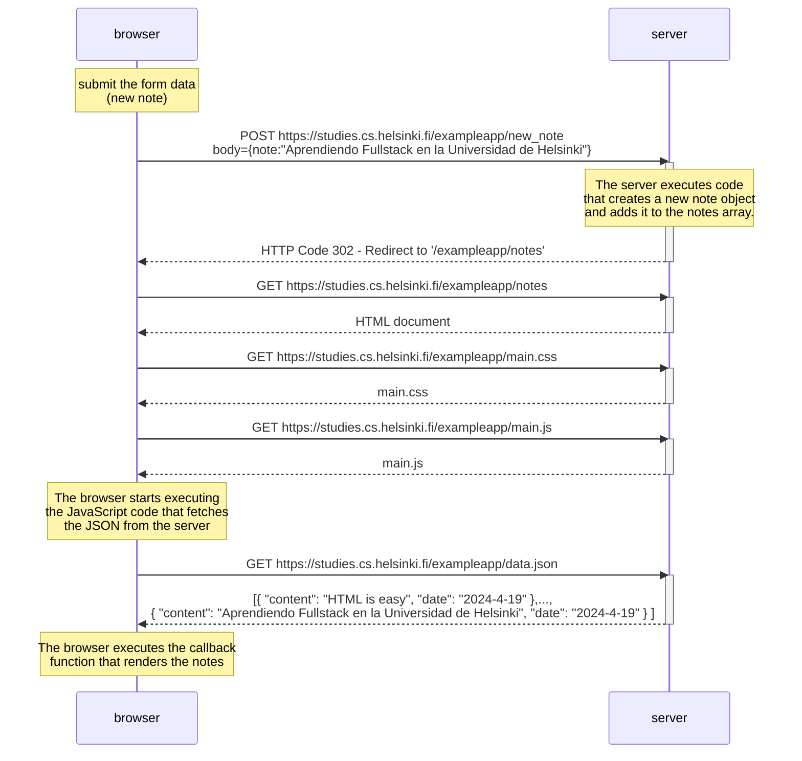

```mermaid
sequenceDiagram
    participant browser
    participant server

    Note over browser: submit the form data <br> (new note)
    browser->>server: POST https://studies.cs.helsinki.fi/exampleapp/new_note <br> body={note:"Aprendiendo Fullstack en la Universidad de Helsinki"}
    activate server
    Note over server: The server executes code <br> that creates a new note object <br> and adds it to the notes array.
    server-->>browser: HTTP Code 302 - Redirect to '/exampleapp/notes'
    deactivate server

    browser->>server: GET https://studies.cs.helsinki.fi/exampleapp/notes
    activate server
    server-->>browser: HTML document
    deactivate server

    browser->>server: GET https://studies.cs.helsinki.fi/exampleapp/main.css
    activate server
    server-->>browser: main.css
    deactivate server

    browser->>server: GET https://studies.cs.helsinki.fi/exampleapp/main.js
    activate server
    server-->>browser: main.js
    deactivate server

    Note over browser: The browser starts executing <br> the JavaScript code that fetches <br> the JSON from the server

    browser->>server: GET https://studies.cs.helsinki.fi/exampleapp/data.json
    activate server
    server-->>browser: [{ "content": "HTML is easy", "date": "2024-4-19" },...,<br>{ "content": "Aprendiendo Fullstack en la Universidad de Helsinki", "date": "2024-4-19" }  ]
    deactivate server

    Note over browser: The browser executes the callback <br> function that renders the notes
```
